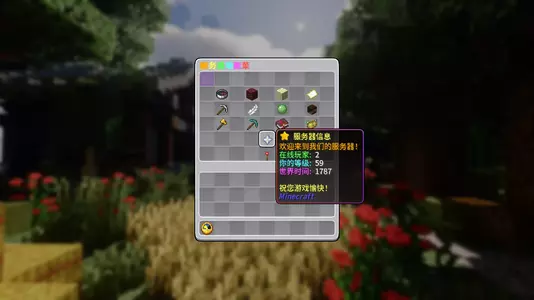
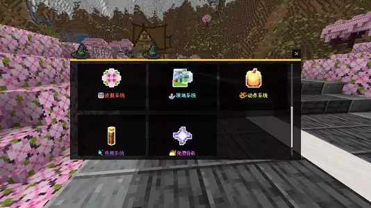
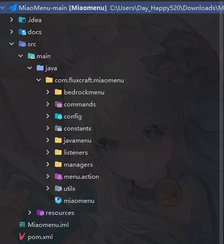
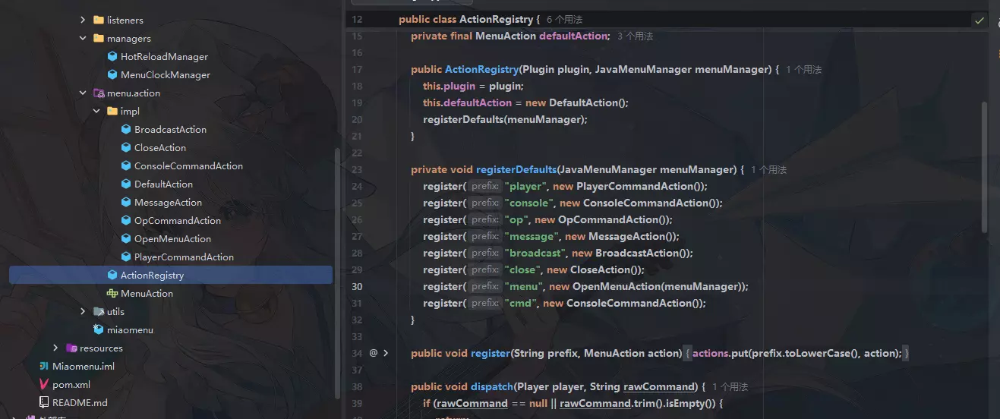
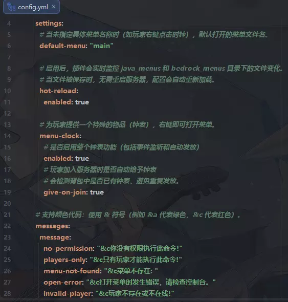

# MiaoMenu

English | [中文](./README_zh_cn.md)

> A lightweight menu plugin for Paper 1.21.11 that delivers native menu experiences to both Java Edition and Bedrock Edition players.

## Overview

MiaoMenu is a dual-platform menu plugin designed for mixed Minecraft servers:

- Java players receive native chest GUI menus
- Bedrock players receive Floodgate form menus
- The plugin automatically detects the player platform and opens the correct menu type
- Supports PlaceholderAPI, proxy server switching, hot reload, and a full requirement system
- Includes a menu clock, example menus, and permission-based access control

Current version: `2.7.7.9`

## Screenshots

### Java Menu Preview




### Bedrock Menu Preview





## Key Advantages

### 1. Native experience for both editions
- Java players interact with familiar chest-based menus
- Bedrock players interact with native mobile-friendly forms
- One command entry point serves both client types automatically

### 2. Built for real server workflows
- PlaceholderAPI support for dynamic menu content
- Floodgate integration for Bedrock player menus
- Proxy-aware server switching for Velocity and BungeeCord-style networks
- CraftEngine fallback material support for custom item resolution

### 3. Complete requirement system
- Supports menu-level `view_requirement`
- Supports item-level `conditions`
- Supports reusable `requirement_blocks`
- Supports `deny_message` and `fallback_menu`
- Supports permission checks, scoreboard progress, advancements, and placeholder comparisons

### 4. Friendly for daily operations
- Supports hot reloading of menu files
- Can auto-generate example menu files
- Menu clock supports auto-give, death protection, and right-click opening
- Visible text is centrally managed through the `messages` section in `config.yml`

### 5. Familiar YAML structure
- Java menu structure is close to DeluxeMenus-style configuration
- Easier to adopt for servers already used to YAML menu management

## Feature Overview

### Java menus
Java menus are stored in `src/main/resources/java_menus/` and support:

- `menu_title`
- `rows`
- `items.<id>.slot`
- `material`
- `custom_model_data`
- `display_name`
- `lore`
- `left_click_commands`
- `right_click_commands`
- `conditions`
- `lock_message`
- `view_requirement`

Example files:
- `test.yml`
- `server-selector.yml`

### Bedrock menus
Bedrock menus are stored in `src/main/resources/bedrock_menus/` and support:

- `menu.title`
- `menu.subtitle`
- `menu.footer`
- `menu.items[*].text`
- `icon`
- `icon_type`
- `command`
- `execute_as`
- `conditions`
- `lock_message`
- `view_requirement`

### Smart menu routing
The plugin automatically checks the player type:

- If the player is a Floodgate Bedrock player, it opens a Bedrock menu
- Otherwise, it opens a Java menu

This allows a single menu command to serve both player groups.

### Command system
The plugin registers the following commands:

```text
/dgeysermenu open <menu-name>
/dgeysermenu reload
/dgeysermenu help
/dgm open <menu-name>
/dgm reload
/dgm help
/fluxmenu open <menu-name>
/getmenuclock
```

Notes:
- `dgm` and `fluxmenu` are aliases of the main command
- `open` opens a specific menu
- `reload` reloads configuration and menu files
- `help` shows the help page
- `getmenuclock` gives the menu clock item

### Menu clock
The menu clock is one of the plugin's signature features:

- Players can automatically receive the clock on join
- Missing clocks can be restored automatically
- The clock is removed from death drops
- Right-clicking the clock opens the default menu
- The item name is controlled by `messages.menu.clock.name`

### Hot reload
When enabled in the config:

- Saving menu files can trigger automatic reloads
- Frequent server restarts are no longer necessary
- Especially useful for rapid menu iteration

### Proxy support
The plugin supports cross-server actions in proxy environments:

- Detects Velocity mode
- Detects BungeeCord-style messaging channels
- Menu buttons can trigger actions such as `server lobby`

See `server-selector.yml` for a built-in example.

### PlaceholderAPI support
If PlaceholderAPI is installed, you can use placeholders in:

- `display_name`
- `lore`
- requirement conditions
- menu feedback text

For example:

```yaml
display_name: "&b%player_name%"
lore:
  - "&fLevel: &e%player_level%"
  - "&fBalance: &6%vault_eco_balance%"
```

## Installation

### Requirements
- Java 21
- Paper 1.21.11 or a compatible implementation
- Floodgate if you want Bedrock menus
- PlaceholderAPI if you want placeholder parsing
- A proxy setup if you want cross-server routing

### Installation steps
1. Put the plugin jar into your server `plugins` directory
2. Start the server
3. On first startup, the plugin generates config files and sample menus
4. Edit `config.yml`, `java_menus/`, and `bedrock_menus/` as needed
5. Use `/dgm reload` or restart the server to apply changes

## Permission Nodes

The permissions declared in `plugin.yml` are:

```yaml
dgeysermenu.*:
  children:
    dgeysermenu.use: true
    dgeysermenu.admin: true
    dgeysermenu.reload: true

dgeysermenu.use:
  default: true

dgeysermenu.admin:
  default: op

dgeysermenu.reload:
  default: op
```

### Permission guide
- `dgeysermenu.use`: allows basic menu commands
- `dgeysermenu.admin`: allows administrative features and the menu clock command
- `dgeysermenu.reload`: allows reloading plugin data
- `dgeysermenu.*`: grants all plugin permissions

### Additional recommendation
You can also use your own server permission nodes inside requirements, for example:

```yaml
requirements:
  - type: permission
    permission: vip.shop
```

This kind of permission is not a built-in plugin permission node, but it can still be used as a business rule in menu access control.

## Configuration Guide

Main config file: `src/main/resources/config.yml`

### Version fields
```yaml
config-version: 15
menu-version: 6
```

- `config-version`: version check for `config.yml`
- `menu-version`: version check for example menu files

### Open-menu sound
```yaml
settings:
  open-menu-sound:
    enabled: true
    sound: "entity.experience_orb.pickup"
    volume: 1.0
    pitch: 1.0
```

Field meanings:
- `enabled`: whether to play a sound when opening a menu
- `sound`: vanilla sound key
- `volume`: playback volume
- `pitch`: playback pitch

### Default menu
```yaml
settings:
  default-menu: "test"
```

This menu opens when a player right-clicks the menu clock.

### Hot reload
```yaml
settings:
  hot-reload:
    enabled: true
```

When enabled, saving menu files can trigger an automatic refresh.

### Auto-generate examples
```yaml
settings:
  auto-generate-examples: true
```

When enabled, missing example menus can be regenerated automatically.

### Proxy network support
```yaml
settings:
  velocity-network: true
```

Notes:
- When set to `true`, the plugin prefers Velocity network behavior
- Useful when your menu contains cross-server buttons

### Custom item fallback material
```yaml
settings:
  item-resolver:
    fallback-material: STONE
```

If an external item provider is unavailable, the plugin falls back to this vanilla material.

### Menu clock
```yaml
settings:
  menu-clock:
    enabled: true
    give-on-join: true
```

Field meanings:
- `enabled`: enables the menu clock feature
- `give-on-join`: gives the clock to players who do not already have one

### Message system
```yaml
messages:
  message:
    no-permission: "&c✦ You do not have permission to use this command."
    players-only: "&c✦ Only players can use this command."
    menu-not-found: "&c✦ No menu named &e{0}&c was found. Please check the spelling."
```

Notes:
- Visible text is intentionally centralized in `messages`
- This makes it easier to localize the plugin or adapt the style to your server

## Java Menu Example Explained

Example file: `src/main/resources/java_menus/test.yml`

```yaml
menu_title: "&6&lMain Menu &7| &fServer Name"
rows: 6
view_requirement:
  deny_message: "&cYou cannot open this menu yet."
  fallback_menu: "test"
  requirements:
    - type: permission
      permission: dgeysermenu.use
items:
  server_info:
    slot: 10
    material: KNOWLEDGE_BOOK
    custom_model_data: 0
    display_name: "&e&lServer Info"
    lore:
      - "&7Click to view server information"
      - "&fOnline Players: &a%server_online%&f/&a%server_max_players%"
    left_click_commands:
      - "[message] &6=== Server Info ==="
      - "[player] list"
      - "[close]"
```

### What each field means
- `menu_title`: chest GUI title
- `rows`: menu row count, from 1 to 6
- `view_requirement`: controls whether the player can open the whole menu
- `deny_message`: message shown when access is denied
- `fallback_menu`: fallback menu opened when access is denied
- `slot`: slot position of the button
- `material`: item material
- `custom_model_data`: resource-pack model id
- `display_name`: button title
- `lore`: button description lines
- `left_click_commands`: actions executed on left click

### Supported material sources
As shown in `test.yml`, `material` can come from multiple sources:

- Vanilla materials such as `PAPER`
- Vanilla material with `custom_model_data`
- `craftengine:namespace:item_id`
- `itemsadder:namespace:item_id`
- `mmoitems:type:id`
- `headdb:head_id`
- `base64head:base64_string`

## Requirement System in Java Menus

### Item-level condition example
```yaml
player_info:
  conditions:
    operator: AND
    requirements:
      - type: placeholder_contains
        placeholder: "%player_name%"
        value: ""
  lock_message: "&cYou do not meet the requirements to view player info yet."
```

This means:
- `conditions` defines item-level access checks
- `operator` decides whether checks are joined by `AND` or `OR`
- `placeholder_contains` checks whether a parsed placeholder contains a value
- `lock_message` is shown when the condition fails

### Advanced condition example
```yaml
shop:
  conditions:
    operator: AND
    requirements:
      - type: advancement
        advancement: "minecraft:story/root"
    children:
      - operator: OR
        requirements:
          - type: permission
            permission: "vip.shop"
          - type: progress
            objective: "trade_count"
            value: 5
```

This configuration means:
- The player must first complete a specific advancement
- Then they must satisfy at least one of the following:
  - have the `vip.shop` permission
  - have a scoreboard progress value of at least 5 for `trade_count`

## Bedrock Menu Example Explained

Example file: `src/main/resources/bedrock_menus/test.yml`

```yaml
menu:
  title: "§6§lMain Menu"
  subtitle: "§7Welcome to the server!"
  footer: "§8Server version 1.21.x"
  items:
    - text: "§a§lTeleport\n§7Quickly travel to different locations"
      icon: "textures/items/compass_item"
      icon_type: "path"
      command: "warp"
      execute_as: "player"
view_requirement:
  deny_message: "&cYou cannot open the Bedrock main menu right now."
  fallback_menu: "test"
  requirements:
    - type: permission
      permission: dgeysermenu.use
```

### Field guide
- `title`: form title
- `subtitle`: form subtitle
- `footer`: form footer
- `items`: button list
- `text`: button label
- `icon`: icon path or URL
- `icon_type`: icon source type
- `command`: command executed on click
- `execute_as`: whether to run as player or console
- `view_requirement`: menu-level access requirement

## Cross-server Menu Example

Example file: `src/main/resources/java_menus/server-selector.yml`

```yaml
items:
  lobby:
    left_click_commands:
      - "[player] server lobby"
      - "[message] &aConnecting to lobby..."
      - "[close]"
```

This pattern is suitable for:
- Velocity networks
- BungeeCord-style proxy networks
- lobby, survival, creative, and minigame server selectors

## Advanced Usage Examples

### 1. Open another menu
```yaml
left_click_commands:
  - "[menu] shop"
```

### 2. Send a player message
```yaml
left_click_commands:
  - "[message] &aWelcome to the menu!"
```

### 3. Execute a player command
```yaml
left_click_commands:
  - "[player] spawn"
```

### 4. Execute a console command
```yaml
left_click_commands:
  - "[console] give %player_name% diamond 1"
```

### 5. Close the menu
```yaml
left_click_commands:
  - "[close]"
```

## Directory Layout

```text
MiaoMenu/
├─ pic/
├─ docs/
├─ src/main/resources/
│  ├─ config.yml
│  ├─ plugin.yml
│  ├─ java_menus/
│  │  ├─ test.yml
│  │  └─ server-selector.yml
│  └─ bedrock_menus/
│     └─ test.yml
```

## Build

```bash
mvn test
mvn package
```

The default artifact is generated in the `target/` directory.

## Troubleshooting

### 1. A menu does not open
Check the following:
- whether the player has `dgeysermenu.use`
- whether the menu name in the command matches the file name
- whether the YAML indentation is correct
- whether `view_requirement` is denying access

### 2. Bedrock menus do not appear
Check the following:
- whether Floodgate is installed correctly
- whether the player is actually joining through Floodgate
- whether the target menu exists in `bedrock_menus/`

### 3. A button click does nothing
Check the following:
- whether the `command` or click action is written correctly
- whether the player has permission for the target action
- whether the console contains error output

### 4. Placeholders are not replaced
Check the following:
- whether PlaceholderAPI is installed
- whether the placeholder expansion is available
- whether the syntax is correct

### 5. Cross-server commands do not work
Check the following:
- whether the proxy network is configured correctly
- whether `velocity-network` matches your network design
- whether proxy forwarding and messaging channels are available

## Best-fit Use Cases

MiaoMenu is well suited for servers that:

- serve both Java and Bedrock players
- need a main menu, feature hub, or server selector
- prefer YAML-based menu configuration
- want PlaceholderAPI-driven dynamic information
- need a low-maintenance requirement system for gated features

## License

This project is distributed under the license declared in the `LICENSE` file.
